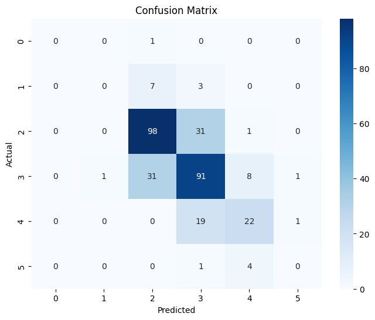

# Wine Quality Prediction

## Overview
This project predicts wine quality using Machine Learning techniques.

## Dataset
- 1599 wine samples
- 11 chemical properties
- Target variable: Quality

## Technologies Used
- Python
- Pandas
- NumPy
- Matplotlib
- Seaborn
- Scikit-Learn
- Google Colab

## Machine Learning Model
Random Forest Classifier

## Accuracy
65.94%

## Project Workflow
1. Data Loading
2. Data Cleaning
3. Exploratory Data Analysis
4. Correlation Analysis
5. Train-Test Split
6. Model Training
7. Prediction
8. Evaluation

 ##Key Findings:
- Alcohol has the strongest positive impact on wine quality.
- Volatile acidity has a negative impact on wine quality.
- Random Forest performed well on the dataset.
- ## Visualizations

### Wine Quality Distribution

### Feature Importance

## Author
Shivanshi Yadav
